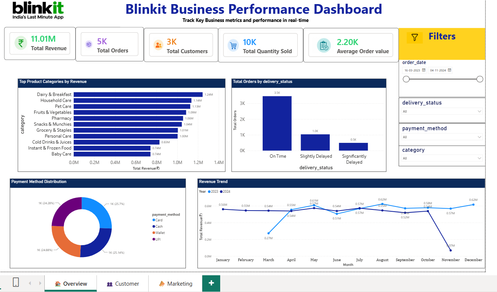
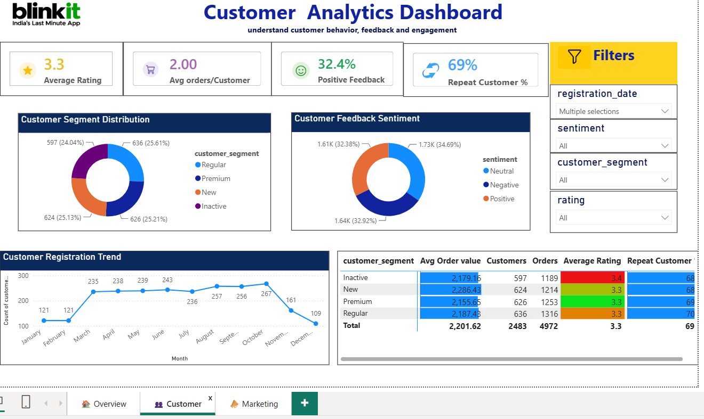
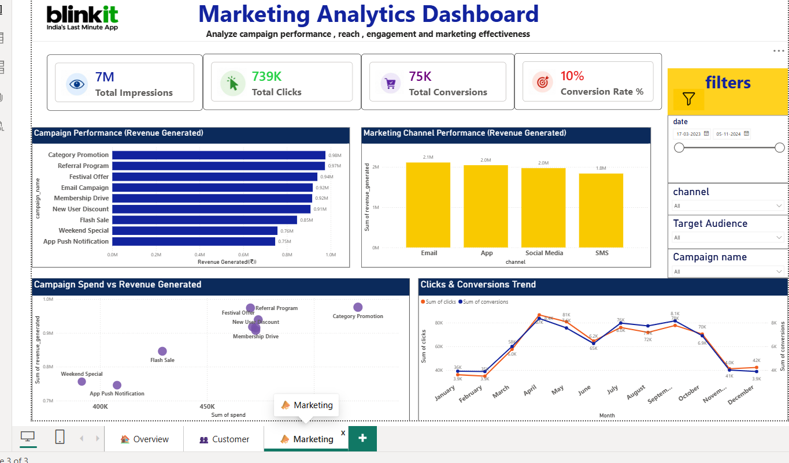

# 📊 Blinkit Business Performance Dashboard

An interactive **Power BI dashboard** developed to analyze Blinkit's business performance across **business operations, customer behavior, and marketing effectiveness**.

The dashboard provides interactive KPIs, visualizations and slicers to help users explore key business metrics and identify performance trends.

---

## 🎯 Project Objective

The objective of this project is to build an interactive business intelligence dashboard that provides a consolidated view of:

- Overall business performance
- Customer behavior and engagement
- Marketing campaign effectiveness
- Revenue and order trends
- Customer segmentation and feedback
- Marketing channel and campaign performance

---

## 📑 Dashboard Pages

### 1. 🏠 Business Overview

Provides a high-level view of overall business performance.

**Key KPIs:**
- Total Revenue
- Total Orders
- Total Customers
- Total Quantity Sold
- Average Order Value

**Analysis Includes:**
- Product category performance
- Delivery status analysis
- Payment method distribution
- Revenue trends over time
- Interactive filtering by date, category, payment method, and delivery status

---

### 2. 👥 Customer Analytics

Focuses on customer behavior, satisfaction, and engagement.

**Key KPIs:**
- Average Rating
- Average Orders per Customer
- Positive Feedback %
- Repeat Customer %

**Analysis Includes:**
- Customer segment distribution
- Customer feedback sentiment
- Customer registration trends
- Customer segment performance
- Interactive filtering by registration date, sentiment, customer segment, and rating

---

### 3. 📢 Marketing Analytics

Analyzes marketing campaign performance and effectiveness.

**Key KPIs:**
- Total Impressions
- Total Clicks
- Total Conversions
- Conversion Rate %

**Analysis Includes:**
- Campaign revenue performance
- Marketing channel performance
- Campaign spend vs revenue generated
- Clicks and conversions trends
- Interactive filtering by date, channel, target audience, and campaign name

---

## 📸 Dashboard Preview

### 🏠 Business Overview

---

### 👥 Customer Analytics

---

### 📢 Marketing Analytics

---

## 🛠️ Tools & Technologies

- **Power BI**
- **Power Query**
- **DAX**
- **Data Modeling**
- **Data Visualization**

---

## 📊 Key Features

- Interactive KPI cards
- Interactive slicers
- Page navigation
- Dynamic dashboard filtering
- Conditional formatting
- Business performance analysis
- Customer analytics
- Marketing analytics
- Trend analysis
- Revenue analysis
- Campaign performance analysis

---

## 💡 Key Insights

- Analyzed overall revenue, order volume, customer count, and quantity sold.
- Evaluated product category and delivery performance.
- Analyzed customer segments, ratings, feedback sentiment, and repeat customer behavior.
- Identified customer registration trends over time.
- Compared marketing campaigns based on revenue generated.
- Evaluated marketing channels using impressions, clicks, and conversions.
- Compared campaign spending with revenue generated to understand marketing effectiveness.
- Tracked clicks and conversions over time.

---

## 🧠 Key Skills Demonstrated

- Data Cleaning & Transformation
- Data Modeling
- DAX Measures
- KPI Development
- Interactive Slicers
- Conditional Formatting
- Business Analytics
- Customer Analytics
- Marketing Analytics
- Data Visualization
- Dashboard Design

---

## 📁 Project Files

| File | Description |
|------|-------------|
| `BLINKIT.pbix` | Power BI dashboard file |
| `Business-Overview.png` | Business Overview dashboard screenshot |
| `Customer-Analytics.png` | Customer Analytics dashboard screenshot |
| `Marketing-Analytics.png` | Marketing Analytics dashboard screenshot |
| `README.md` | Project documentation |

---

## 🚀 How to Use

1. Download or clone this repository.
2. Open `BLINKIT.pbix` using **Microsoft Power BI Desktop**.
3. Refresh the data if the required dataset is available.
4. Use the slicers and page navigation to explore the dashboard.
5. Navigate between:
   - Business Overview
   - Customer Analytics
   - Marketing Analytics

---

## 📌 Project Highlights

This project demonstrates the use of **Power BI, Power Query, DAX, data modeling, and interactive visualization** to transform business data into an easy-to-understand analytical dashboard.

The dashboard is designed to provide different perspectives of the business through **operations, customer, and marketing analytics**.

---

## 👩‍💻 Author

**Meghana Rajeswari Akula**

Computer Science Engineering – Data Science
